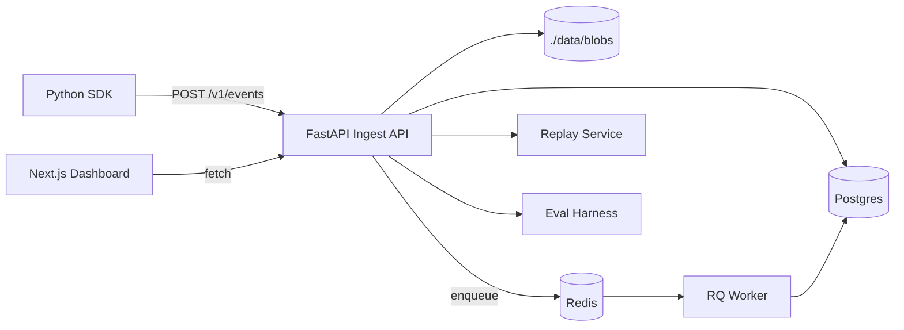

# AgentOps

Open-source observability, replay, and evaluation for LLM agent workflows.

## Features (MVP)

- Python SDK instrumentation for runs + spans across LLM, tool, retrieval, and custom work.
- FastAPI ingest API for batched events with gzip support.
- Postgres-backed run/span metadata and metrics.
- Local blob store (`./data/blobs`) for large payloads (gzipped JSON).
- RQ + Redis worker to aggregate token/cost/latency/error metrics.
- Replay engine with exact replay + live replay stub.
- Eval harness with JSON report persisted in blob storage + Postgres row.
- Next.js dashboard for runs, run timeline, replay trigger, and eval list.

## Repository structure

- `agentops_sdk/` - tracing SDK, redaction, HTTP exporter, mock provider, toy example.
- `server/` - FastAPI routes, DB models/session, blob/replay/aggregation services.
- `worker/` - RQ worker + aggregation job.
- `dashboard/` - Next.js 14 app-router UI.

## Architecture



## Quickstart

### 1) Start the stack

```bash
docker compose up --build
```

### 2) Run SDK example

In a separate shell:

```bash
pip install -e .
python agentops_sdk/examples/toy_agent.py
```

### 3) Open dashboard

- Dashboard: http://localhost:3000/runs
- API docs: http://localhost:8000/docs

Then inspect the run timeline and trigger replay from `/replay/[id]`.

## API contracts

- `POST /v1/runs` create run
- `PATCH /v1/runs/{run_id}` update run
- `POST /v1/events` ingest event batch
- `GET /v1/runs` list runs
- `GET /v1/runs/{run_id}` run detail + spans
- `POST /v1/replay/{run_id}` trigger replay
- `POST /v1/evals/run` execute eval set
- `GET /v1/evals` list eval runs
- `GET /v1/evals/{id}` eval detail

## Screenshots

- Placeholder: add dashboard screenshots after local startup.

## Notes

- `server/main.py` currently uses `Base.metadata.create_all()` for MVP.
- Add Alembic migrations for production schema lifecycle.
